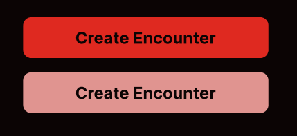

# Sprint 1 - A Working UI Prototype

## Sprint Goals

Develop a prototype that simulates the key functionality of the system, then test and refine it so that it can serve as the model for the next phase of development in Sprint 2.

[Figma](https://www.figma.com/) is used to develop the prototype.

---

## Initial Database Design

This first database design allows for different encounters to have multiple initiative slots connected to a character, each character has different stats and can be activated/deactivated in the initiative, the initiative table is used to display and connect the characters table to each encounter.

---

## UI 'Flow'

The first stage of prototyping was to explore how the UI might 'flow' between states, based on the required functionality.

This Figma demo shows the initial design for the UI 'flow':

<iframe style="border: 1px solid rgba(0, 0, 0, 0.1);" width="300" height="350" src="https://embed.figma.com/proto/L42lq6V4v4lAU3iIqodMhr/D-D-Tracker---Flow-1?node-id=1-5&p=f&scaling=min-zoom&content-scaling=fixed&page-id=0%3A1&starting-point-node-id=1%3A5&embed-host=share" allowfullscreen></iframe>

### Testing

I showed this prototype to my end-user and they liked the flow, however they said that they should be able to go back when performing any actions and have more options to navigate to other pages.

### Changes / Improvements

I added 'back' buttons when adding encounters or creatures and also added a 'all encounters' button that links back to the main page and allows the user return to the list of Encounters. This flow makes the web app more efficient and easy to use, ensuring the end-user is able to use the web app to its full effect. 

<iframe style="border: 1px solid rgba(0, 0, 0, 0.1);" width="300" height="350" src="https://embed.figma.com/proto/Rvp94YJ6LJ56XJRkz7hEye/D-D-Tracker---Flow-2?scaling=min-zoom&content-scaling=fixed&page-id=0%3A1&node-id=1-5&starting-point-node-id=1%3A5&embed-host=share" allowfullscreen></iframe>

---

## Initial UI Prototype

The next stage of prototyping was to develop the layout for each screen of the UI.

This Figma demo shows the initial layout design for the UI:

<iframe style="border: 1px solid rgba(0, 0, 0, 0.1);" width="400" height="450" src="https://embed.figma.com/proto/nAmGCo3rSfHVO18pmauVRU/D-D-Tracker---Design-1?node-id=1-5&p=f&scaling=min-zoom&content-scaling=fixed&page-id=0%3A1&starting-point-node-id=1%3A5&embed-host=share" allowfullscreen></iframe>

### Testing

My end-user after testing it told me to add a way to see character details more easily and so that only the important details can go on the encounter page preserving space and keeping the page less cluttered.

### Changes / Improvements

I decided to add a dropdown that you can access from the encounter screen by clicking on a character which lets you see all of the details about each character.

### Testing

I showed this to my end user and they liked the improvement but they said "You need a way to delete the characters from the encounter or deactivate them" Which means that the characters can easily be manipulated from within the dropdowns.

### Changes / Improvements

I added the buttons:
- "Deactivate" - so that the users can remove the character from initiative.
- "Add extra turn" - so that the users can give the character another place in the initiative.
- "Delete" - so that the users can delete the character from the encounter.

My end user approved this change and had no more suggestions.

<iframe style="border: 1px solid rgba(0, 0, 0, 0.1);" width="400" height="450" src="https://embed.figma.com/proto/FENNKoCWYAOKxmx1g8VTbP/D-D-Tracker---Design-2?node-id=1-5&p=f&scaling=min-zoom&content-scaling=fixed&page-id=0%3A1&starting-point-node-id=1%3A5&embed-host=share" allowfullscreen></iframe>

---

## Refined UI Prototype

Having established the layout of the UI screens, my prototype was refined visually using colour and shaping.

I showed my end user some colour scheme suggestions for the design of the website:

My end user ultimately decided on theme 2 as they liked the all red theme, I then used this theme when refining the UI prototype.

<iframe style="border: 1px solid rgba(0, 0, 0, 0.1);" width="360" height="800" src="https://embed.figma.com/proto/AgRufIIWhsML8vOGFdJWQr/D-D-Tracker---Design-3?node-id=2001-2&p=f&scaling=scale-down&content-scaling=fixed&page-id=0%3A1&starting-point-node-id=2001%3A2&embed-host=share" allowfullscreen></iframe>

### Testing

I tested this version with my end-user and they liked the colours but encouraged me to include a dark mode for the website.

### Changes / Improvements

As I was finalising the colours, I asked my end-user multiple times to make decisions about specific colour layouts.

I asked my user which initiative colour design they wanted, and they chose the first option.

I asked my user which button colour design they preffered, and they chose the stronger accented red.

<iframe style="border: 1px solid rgba(0, 0, 0, 0.1);" width="360" height="800" src="https://embed.figma.com/proto/5VQZQgasq3PHQa0Dc8EIri/D-D-Tracker---Design-4?node-id=2001-2&p=f&scaling=scale-down&content-scaling=fixed&page-id=0%3A1&starting-point-node-id=2001%3A2&embed-host=share" allowfullscreen></iframe>

---

## Sprint Review

The sprint went well, few major issues and most changes made to improve design and quality of life for the user.

The Refined prototypes were made using a phone as an example device, this is to make sure that the website looks good and functions effectively on handheld devices that might be used by the end user.

