# Sprint 2 - A Minimum Viable Product (MVP)

## Sprint Goals

Develop a bare-bones, working web application that provides the key functionality of the system, then test and refine it so that it can serve as the basis for the final phase of development in Sprint 3.

---

## Implemented Database Schema

Replace this text with notes regarding the DB schema.

---

## Initial Implementation

Main Page / List of encounters:

- Multiple links to the main page and encounter creation page (Nav and Button).
- List of existing encounters
- 'pin' system to prioritize encounters
- Delete button for each encounter

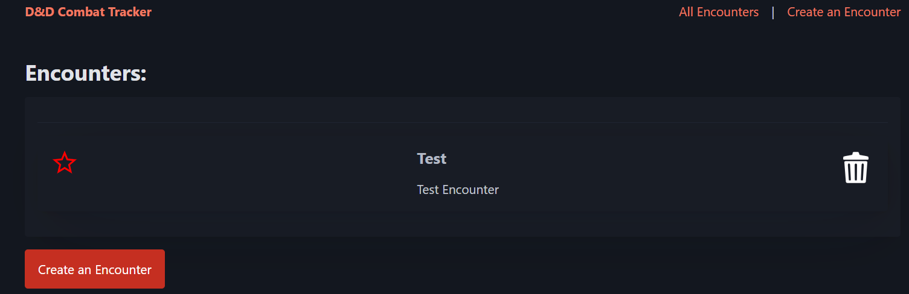

Creating an Encounter:

- Inputs for name and description of encounter

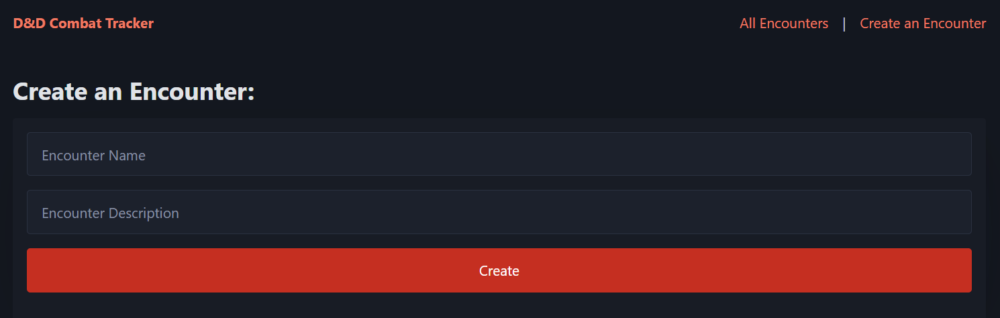

Viewing an Encounter:

- Name and description of encounter
- Turns ordered by initiative roll
- Roll button for turns without initiative
- Section for characters that are inactive
- Dropdown button for each turn to show the related character dropdown

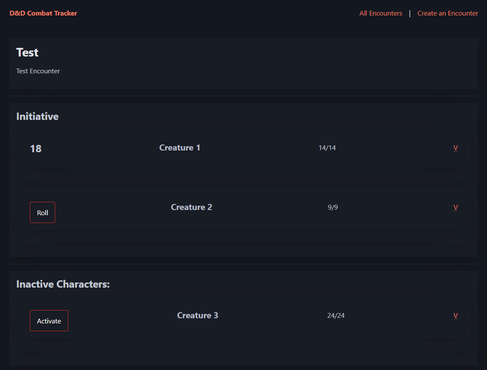

Character Details Dropdown:

- Editable information form for the character with a 'save changes' button
- Multiple buttons allowing the manipulation of the character or turn in the encounter

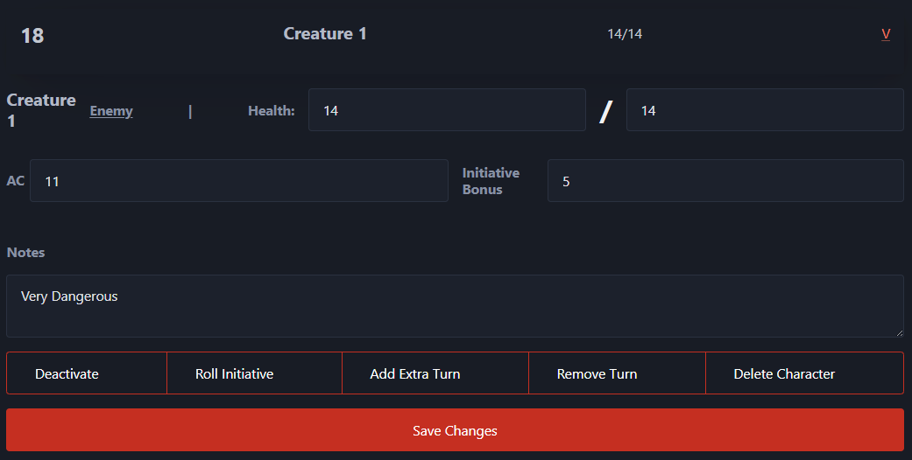

Adding a Character:

- Inputs for name, character type, notes and all other character information

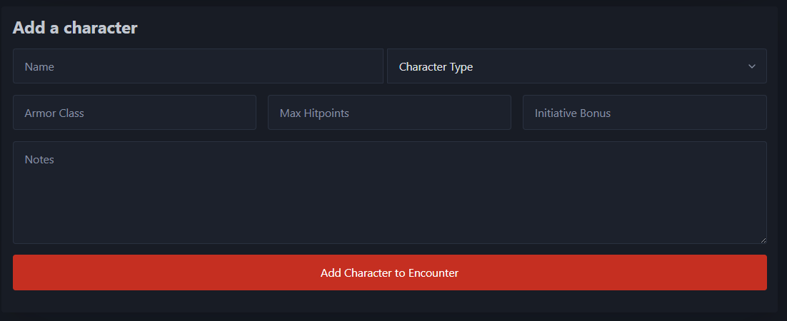

---

## Testing Creating

Creating a test encounter and making sure it is properly inserted into the database.

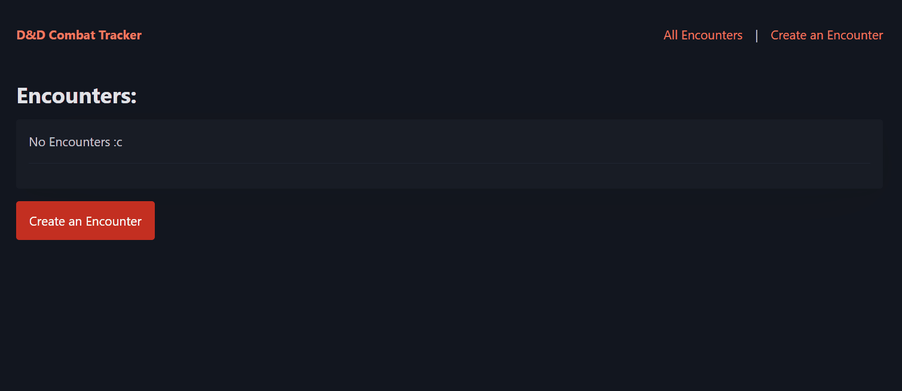

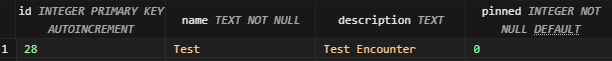

The encounter is successfully created and inserted into the database.

This same functionality is replicated when creating a character:

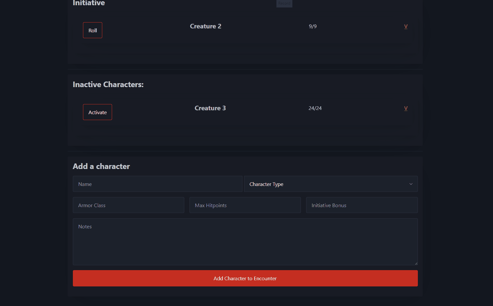

This worked well until I tested it without entering a name:

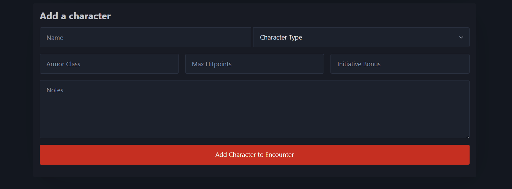

This resulted in a character without a name which is not ideal and likely to cause issues in the future, I fixed this by adding the 'required' tag to the input so that if it is empty, the form will not submit.

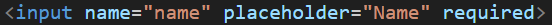

# THIS GIF IS UNFINISHED, NEED TO RECREATE ^

I added this feature to every input in the website to prevent this same issue.

---

## Testing Deleting

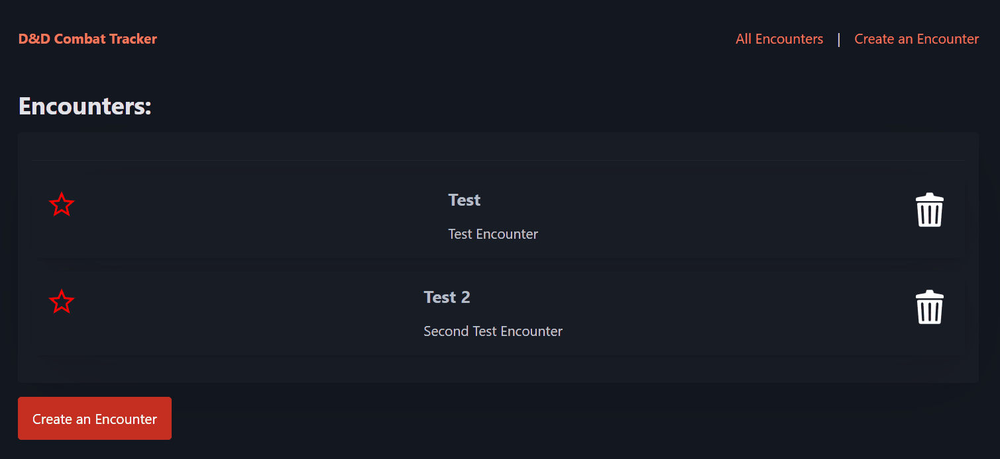

### Changes / Improvements

Testing this, I found that if you accdentally click the delete button, there is no way of going back which is a problem and a poor functionality issue, I fixed this by adding a confirmation whenever you click the delete button, this means that you have the freedom to go return without deleting the encounter

This feature is now in use across the entire website.

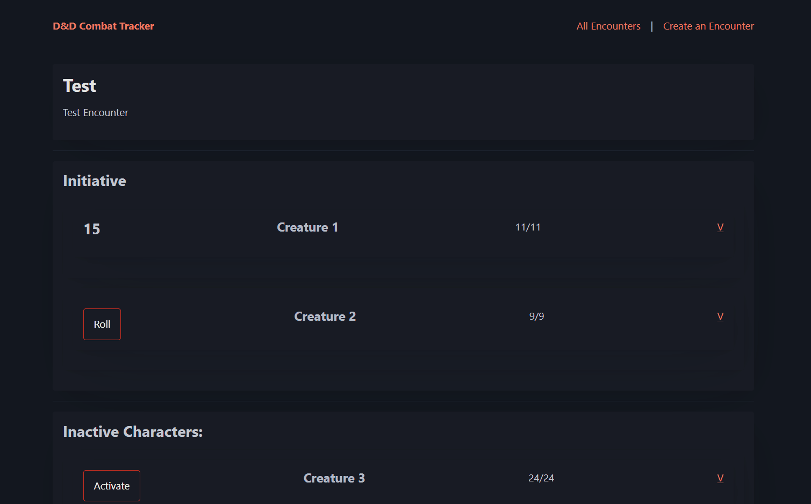

---

Both the creating and deletion features can be seen in the add and remove turn functions:

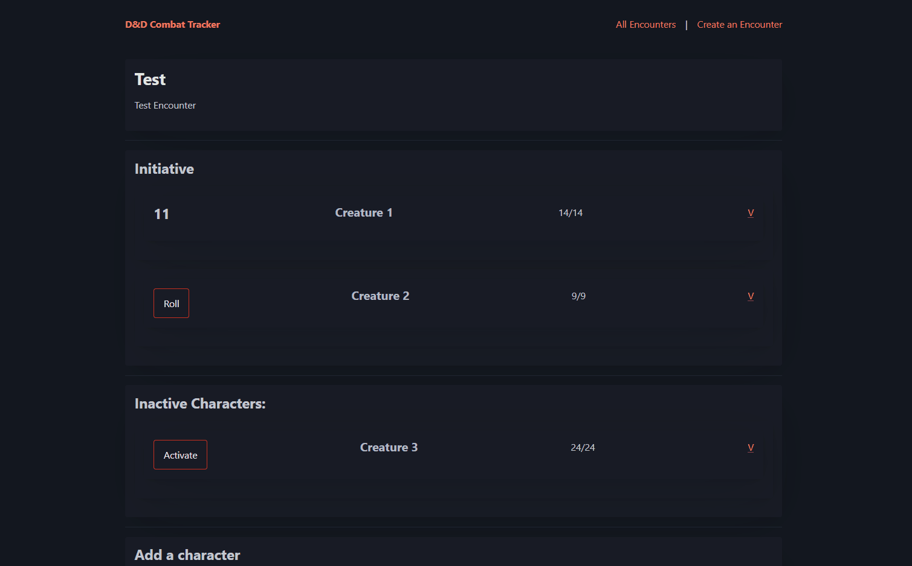

---

## Testing Updating Character Details

Rolling the initiative of each character after it is created is important, I added a 'roll' button when the character does not already have an initiative value.

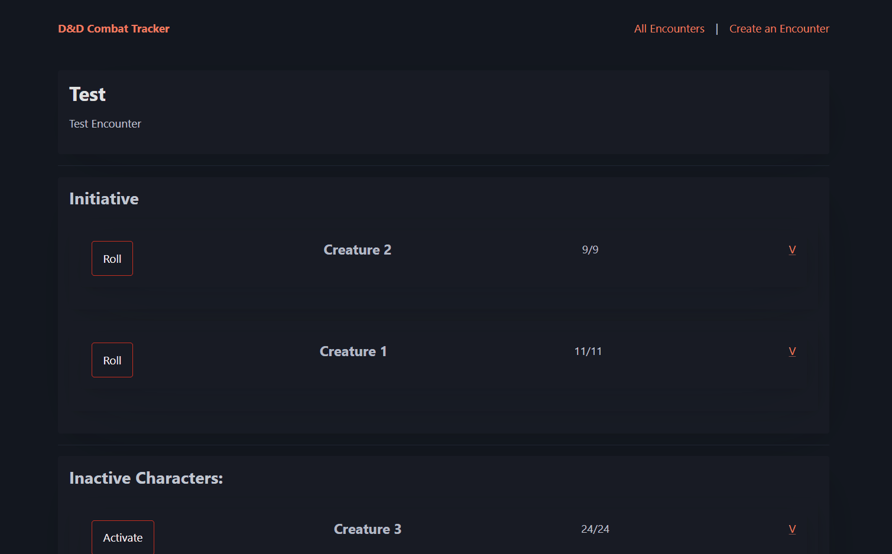

### Changes / Improvements

The functionality of this can be replicated in the character dropdown so that the users can update character details at any point.

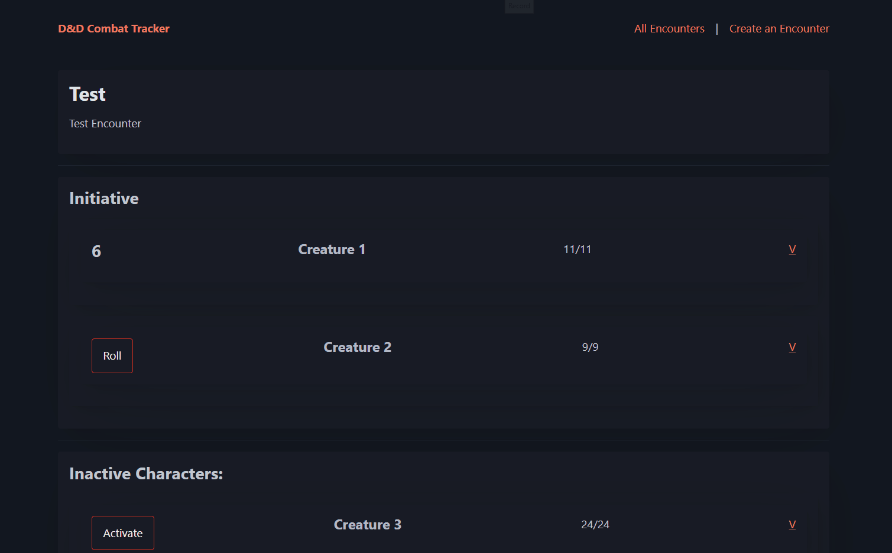

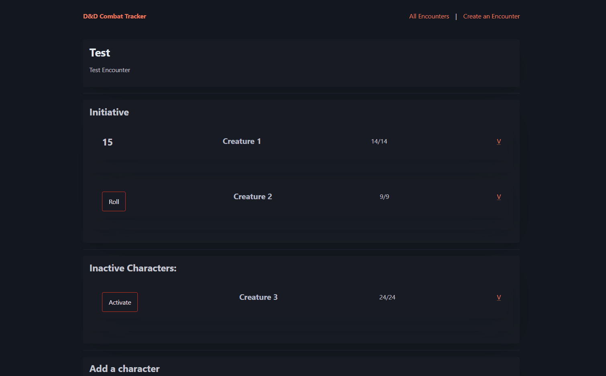

This functionality can also be used in the pin encounter feature:

---

## Sprint Review

This sprint went well, most of the features and functions were quite similar across the site and so were easy to replicate, the few issues I found were mostly with usability and quality of life.

All the functions I added, I tested with my end user and they liked everything and though the functionality was in a good state, they had some suggestions for more rows in the character database table for more things in the dropdown but they can be easily implemented and customized to the end-users needs.

Example site usage:

