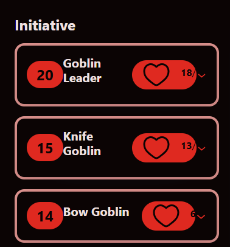
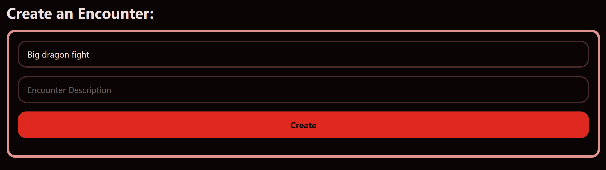

# Sprint 3 - A Refined and Complete System

## Sprint Goals

Develop the system until it is fully featured, with a refined UI and it satisfies the requirements. The system will be fully tested at this point.

---

## Refinement Implementation

Main Page / List of encounters:

- Coloured section borders
- Organized horizontal items evenly
- Added proper icons (Two different Icons for the star)

Creating an Encounter:

- Coloured section borders and form inputs

Viewing an Encounter:

- Coloured section borders and spacing
- Organized row items evenly
- Added heart icon and coloured areas for information
- Reworked dropdown arrow to spin when clicked

Character Details Dropdown:

- Coloured section borders and form inputs
- Coloured text based on information

Adding a Character:

- Coloured section borders and form inputs

## Testing Icons

I updated the icons, replacing the old star with a new star, adding a crown icon to the nav menu and replaced the old white bin icon with a slightly transparent red delete icon.

### Changes / Improvements

When I showed the refinement to my end-user, they said that they would rather a different icon for the nav menu and a rubbish bin Icon for the delete button rather than the backspace icon, they also said that when an encounter is pinned to the top, the star Icon should become filled to show that it is pinned.

I chose a new bin icon for the delete button to make sure it was more clear and then asked my end user which icon they liked for the nav menu and they decided on the star that was already in use. I also found a filled svg for the star and added it to the pinned section.

---

## Testing Resizing for smaller devices

When I tested resizing my web app using multiple different screen sizes, my formatting would break and the website would become messy and hard ore even impossible to use.

### Changes / Improvements

I first fixed the problematic initiative row squishing by making it so that when the screen width is reduce beyond a certian point, the heart icon would dissapear to make room for the text, this change allowed the initiative rows to work more effectively on smaller sized screens

To fix the resizing of the dropdown I had to reorganise the row of buttons so that they could be seperated if the page was resized, this meant that they would organise themselves vertically rather than extend beyond the bounds of the web page, I also made it so that the health section would rearrange itself and one of the big spaces which was causing problems will now dissapear when the page gets small enough.

Both of these changes worked well with a variety of different device sizes.

---

## Testing Colours

The end user liked the usage of colors in  the website, having no issues with the color scheme.

When I my end user was testing my refinement, they pointed out that when they were creating an encounter, the placeholder text looked identical to the input text which caused them some confusion.

### Changes / Improvements

I changed the placeholder text in the inputs to 40% opacity so that it can be easily differentiated from user input text.

My end user approved of this change, and so I implemented it in every single input on the web app.

---

## Testing Large inputs

While my end user was testing my website, they created a character with very high values and it resulted in a lot of overflowing text which was a problem for usability.

### Changes / Improvements

I fixed this by increasing the size of the value boxes in the initiative row and also centred the text to make sure it looks nice, I then added reasonable maximums to the inputs so that the users cannot cause further errors when doing things they arent supposed to.

---

## Sprint Review

Most of this sprint was spent working around usability or accessibility issues and once those were fixed, the website was in good shape, I think this sprint went well, there were issues and some were rather difficult to solve however the site turned out well and both myself and my end user are happy with it.

